<!-- Animated Header -->

<!-- Typing SVG -->

 

<!-- Profile Badges -->

---

## 🧑‍💻 About Me

> *AI Engineer Student at **PIAIC** passionate about building intelligent systems that solve real-world problems.*

- 🤖 Building **Autonomous AI Agents** using LLMs, tools & memory
- 🌱 Currently mastering **Agentic AI & Cloud Native** technologies
- ⚡ Creating **Python-based AI automation** workflows
- 🐳 Deploying with **FastAPI + Docker** pipelines
- 📚 Sharing projects & learnings publicly on GitHub
- 💼 **Open to Job & Freelance** opportunities

 

---

## 🗺️ My Journey

```mermaid
graph LR
    A[🌐 Frontend Dev] -->|HTML CSS JS| B[🧩 Interactive Projects]
    B -->|Problem Solving| C[🐍 Python & AI]
    C -->|LLMs & Agents| D[🤖 Agentic AI]
    D -->|APIs & Cloud| E[🚀 Full-Stack AI Engineer]
    
    style A fill:#6C63FF,stroke:#333,color:#fff
    style B fill:#7C73FF,stroke:#333,color:#fff
    style C fill:#8C83FF,stroke:#333,color:#fff
    style D fill:#9C93FF,stroke:#333,color:#fff
    style E fill:#FF6B6B,stroke:#333,color:#fff
```

---

## 🛠️ Tech Stack & Tools

### 💻 Languages

### 🤖 AI & ML

### 🔧 Frameworks & Tools

---

## 🤖 Featured AI Projects

| # | Project | Description | Tech Stack |
|:-:|:--------|:------------|:-----------|
| 🎭 | **[Role Based Chatbot](github_link)** | AI chatbot with Doctor, Lawyer & Teacher personas | `Python` `Groq` |
| 📰 | **[News AI Agent](github_link)** | Fetches & summarizes global news using AI agents | `GNews API` `Groq` |
| 📖 | **[AI Study Assistant](github_link)** | Chat with any PDF/TXT document intelligently | `PyPDF2` `Groq` |
| 🔍 | **[Agentic RAG](github_link)** | Smart document search for large files using RAG | `TF-IDF` `Groq` |
| 📝 | **[MCQ Generator](github_link)** | Auto-generates MCQs from any uploaded PDF | `PyPDF2` `Groq` |
| 🌐 | **[AI API](github_link)** | REST API with chat, translate & summarize endpoints | `FastAPI` `Docker` |

> 💡 *Click on any project name to explore the repository!*

---

## 📊 GitHub Analytics

 

---

## 🏆 GitHub Trophies

---

<!-- Snake Animation -->

  

---

## 🤝 Connect with Me

 

### 💬 *"Building the future, one AI agent at a time."*

 

📌 **Open to collaboration, freelance work, and learning opportunities!**

---

